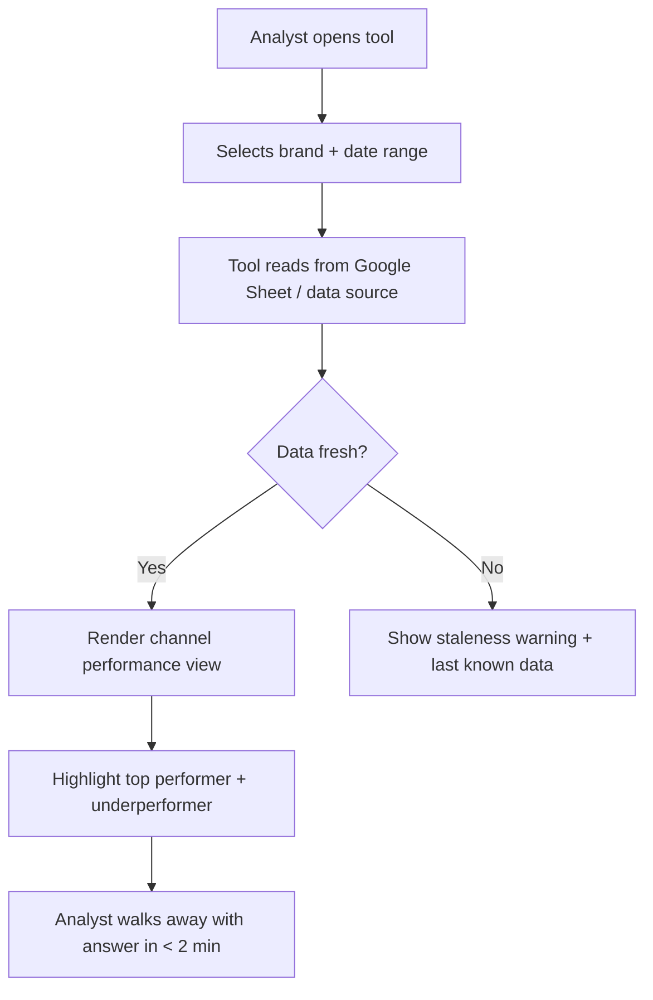
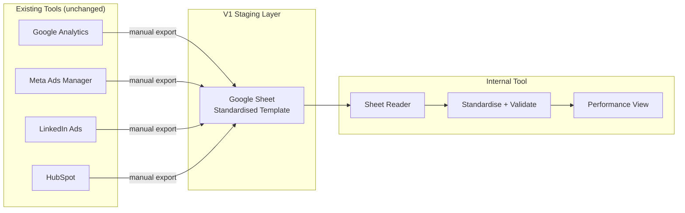

# Flow Diagrams: Task 1 — Product Scoping

This document maps out the User Flow and Data Flow architectures for the v1 internal marketing performance tool.

---

## 1. User Flow Diagram
This flowchart tracks how an internal analyst interacts with the dashboard to quickly answer their primary questions.

---

## 2. Data Flow Diagram
This flowchart displays the architecture of the data flow, showing how data moves from original sources to the staging layer and into the standardized internal tool.

